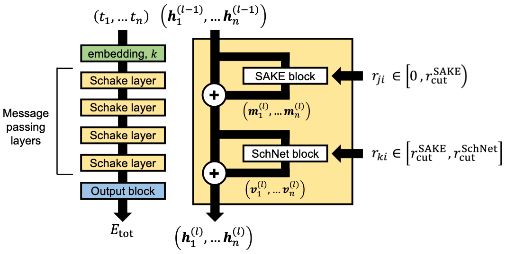

# Scaling Graph Neural Networks to Large Proteins

Justin Airas and Bin Zhang&ast;

*Department of Chemistry, Massachusetts Institute of Technology, Cambridge, MA 02139-4307, United States*

&ast;Corresponding Author: Bin Zhang. E-mail: binz@mit.edu

## Schake architecture
The multiscale Schake (**Sch**Net / S**AKE** hybrid) architecture uses a [SAKE](https://arxiv.org/abs/2301.08893)
 message-passing layer to process information from neighboring atoms *j* within a short distance from atom *i*, followed by a [SchNet](https://doi.org/10.1063/1.5019779) 
message-passing layer to process information from neighboring alpha carbons atoms *k* beyond the short distance cutoff used within the SAKE message-passing layer.

Code implementing this model in PyTorch, along with a Jupyter Notebook showing how to use the model for any set of atom types and Cartesian coordinates, is available [here](Schake/).

 

If using this model, please cite the following works:
 1. Airas, J.; Zhang, B. Scaling Graph Neural Networks to Large Proteins. *arXiv* **2024**, arXiv:2410.03921.
 2. Wang, Y.; Chodera, J. D. Spatial Attention Kinetic Networks with E(n)-Equivariance. *arXiv* **2023**, arXiv:2301.08893.
 3. Schütt, K. T.; Sauceda, H. E.; Kindermans, P.-J.; Tkatchenko, A., Müller, K.-R. SchNet - A deep learning architecture for molecules and materials. *J. Chem. Phys.* **2018**, *148*, 241722.

## DISPEF Subsets
Most GNNs are designed and optimized to produce accurate predictions for small molecule datasets. Our custom **D**ataset of **I**mplicit **S**olvation **P**rotein **E**nergies and **F**orces contains over 200,000 proteins ranging in size from 16 to 1,022 amino acids, along with their implicit solvation free energies (a many-body energy term) and corresponding forces. DISPEF enables evaluation and future design of GNNs for large, biologically-relevant proteins.

The three main subsets of DISPEF, referred to as DISPEF-S, DISPEF-M, and DISPEF-L are available on [Zenodo](https://doi.org/10.5281/zenodo.13755810).

The smaller subset of DISPEF used to assess the computational cost of GNNs (referred to as DISPEF-c) is available [here](datasets/).

Note that to load all DISPEF subset files, the file [dataset_prep.py](datasets/dataset_prep.py) must first be imported. For an example of how to load a DISPEF subset file, see [this Jupyter Notebook](var_size_batch_sampler/example_using_var_size_batch_sampler.ipynb).

If using any of the DISPEF subsets, please cite our work.

## Variable-size batch sampler
To conduct training on DISPEF, we constructed a custom PyTorch batch sampler. Unlike a typical batch sampler that bins a user-set, fixed number of samples into each batch, our custom batch sampler instead bins molecules based on a running tally of the total number of atoms of all molecule samples added to that batch. This ensures more efficient utilization of GPU memory during training.

Code implementing this custom batch sampler, along with a Jupyter Notebook showing how to implement it, can be found [here](var_size_batch_sampler). If using this batch sampler, please cite our work.
