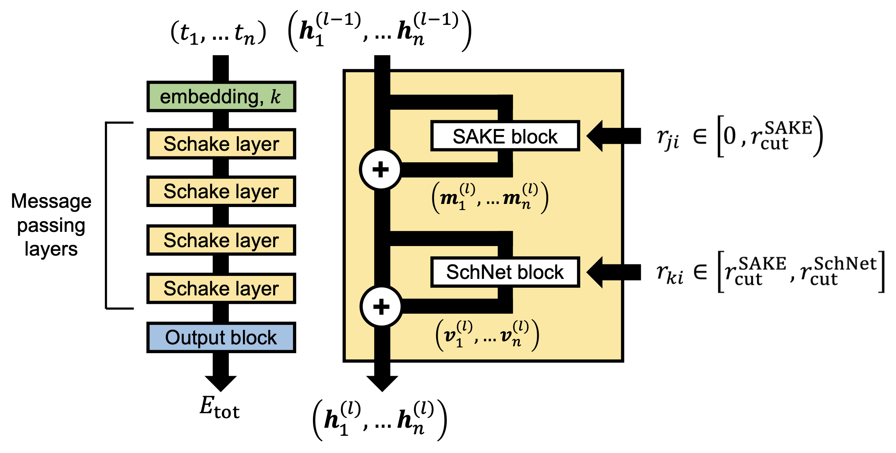

# Scaling Graph Neural Networks to Large Proteins

Justin Airas and Bin Zhang&ast;

*Department of Chemistry, Massachusetts Institute of Technology, Cambridge, MA 02139-4307, United States*

&ast;Corresponding Author: Bin Zhang. E-mail: binz@mit.edu

## Schake architecture
The Schake (**Sch**Net / S**AKE** hybrid) architecture uses a [SAKE](https://arxiv.org/abs/2301.08893)
 message-passing layer to process information from neighboring atoms *j* within a short distance from atom *i*, followed by a [SchNet](https://doi.org/10.1063/1.5019779) 
message-passing layer to process information from neighboring alpha carbons atoms *k* beyond the short distance cutoff used within the SAKE message-passing layer.

Code implementing this model in PyTorch, along with a Jupyter Notebook showing how to use the model for any set of atom types and Cartesian coordinates, is available [here](Schake/).

 

If using this model, please cite the following works:
 1. Airas, J.; Zhang, B. **WIP**
 2. Wang, Y.; Chodera, J. D. Spatial Attention Kinetic Networks with E(n)-Equivariance. *arXiv* **2023**, arXiv:2301.08893.
 3. Schütt, K. T.; Sauceda, H. E.; Kindermans, P.-J.; Tkatchenko, A., Müller, K.-R. SchNet - A deep learning architecture for molecules and materials. *J. Chem. Phys.* **2018**, *148*, 241722.

## Datasets
**WIP**

## Size-dependent batch sampler
To conduct training on our protein datasets, we constructed a custom PyTorch batch sampler. Unlike a typical batch sampler that bins a user-set, fixed number of samples into each batch, our custom batch sampler instead bins molecules based on a running tally of the total number of atoms of all molecule samples added to that batch. This ensures more efficient utilization of GPU memory during training.

Code implementing this custom batch sampler, along with a Jupyter Notebook showing how to implement it, can be found [here](var_size_batch_sampler). If using this batch sampler, please cite our work.
