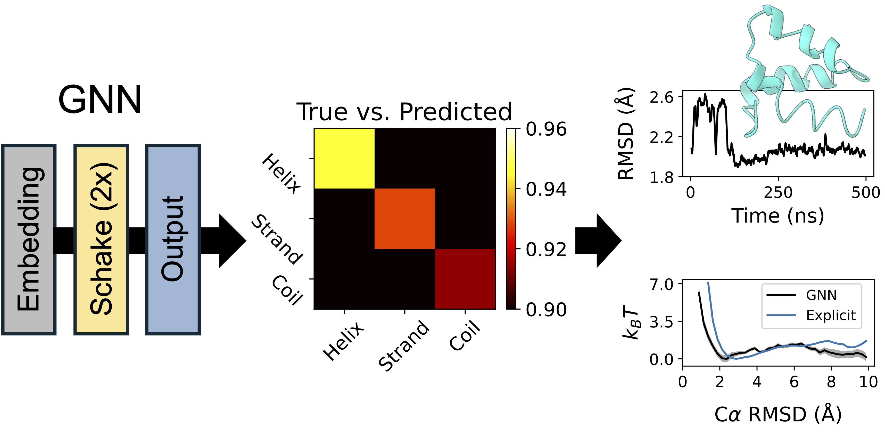

# Knowledge Distillation of a Protein Language Model Yields a Foundational Implicit Solvent Model

Justin Airas and Bin Zhang&ast;

*Department of Chemistry, Massachusetts Institute of Technology, Cambridge, MA 02139-4307, United States*

&ast;Corresponding Author: Bin Zhang. E-mail: binz@mit.edu

## Table of Contents
* [Introduction](#introduction)
* [Schake (version 2)](#schake-(version-2))
* [Implementation in MD simulations](#implementation-in-md-simulations)
* [References](#references)

## Introduction


We introduce a novel strategy that distills the evolutionary information learned by a protein language model, [ESM3](https://github.com/evolutionaryscale/esm), into a computationally efficient graph neural network (GNN). We show that this GNN potential, trained on effective energies from ESM3, is robust enough to drive stable, long-timescale molecular dynamics simulations. When combined with a standard electrostatics term, our hybrid model accurately reproduces protein folding free-energy landscapes and predicts the structural ensembles of intrinsically disordered proteins. This approach yields a single, unified model that is transferable across both folded and disordered protein states, resolving a long-standing limitation of conventional implicit solvent models.
 
While these results establish a compelling proof of principle, our present model is not yet production-ready. Schake was trained primarily on folded structures, and future efforts will benefit from expanding the training set to better represent IDPs, systematically fine-tuning against explicit-solvent simulations, and optimizing GPU kernels to unlock even greater simulation throughput.

## Schake (version 2)
This modified Schake architecture is designed to act on backbone alpha carbon, carboxyl group carbon, and amino group nitrogen atoms. Secondary structure likelihoods are predicted at each bead, and these are then converted to an energy contribution.

Code for the model is provided in [Schake_model_v2.py](Schake_model_v2.py), while an example of how to save a JIT traced version of the model is provided in the [Jupyter Notebook](save_traced_models.ipynb). Trained weights for the model are provided in [Schake_trained_weights.pt](Schake_trained_weights.pt).

## Implementation in MD simulations
With [OpenMM](https://openmm.org/) and its PyTorch plugin [OpenMM-Torch](https://github.com/openmm/openmm-torch) installed, a JIT traced version of this model can be loaded into OpenMM for use as an ML implicit solvent model.

The environment used in our paper to run ML/MD simulations was created as follows with conda/mamba:
```bash
conda create -n omm8ml openmm-torch pytorch-gpu pytorch_cluster cudatoolkit=11.2 -c conda-forge
```

The model can then be loaded into OpenMM as follows:
```python
# other imports above
from openmmtorch import TorchForce

# system setup code

# Add TorchForce
Schake = TorchForce('traced_model.pt')

U_torch = CustomCVForce('T * E_scale * U_Schake')
U_torch.addCollectiveVariable('U_Schake', Schake)
U_torch.addGlobalParameter('E_scale', E_scale) # E_scale is gamma from paper
U_torch.addGlobalParameter('T', temp) # T is system temperature
system.addForce(U_torch)

# rest of code below
```

If using this model, we recommend setting gamma to 0.175.
The AMBER [ff14SBonlysc](https://pubs.acs.org/doi/10.1021/ja5032776) force field and the [GBn2](https://pubs.acs.org/doi/abs/10.1021/ct3010485) electrostatic screening term should also be used with this GNN.

## References
The original architecture is detailed in the following work:
* Airas, J.; Zhang, B. Scaling Graph Neural Networks to Large Proteins. *J. Chem. Theory Comput.* **2025**, *21*(4), 2055-2066. [JCTC paper](https://pubs.acs.org/doi/full/10.1021/acs.jctc.4c01420)

The preprint detailing our recent model is available on arXiv:
* Airas, J.; Zhang, B. Knowledge Distillation of a Protein Language Model Yields a Foundational Implicit Solvent Model. *arXiv* **2026**, arXiv:2601.05388. [arXiv preprint](https://arxiv.org/abs/2601.05388)
